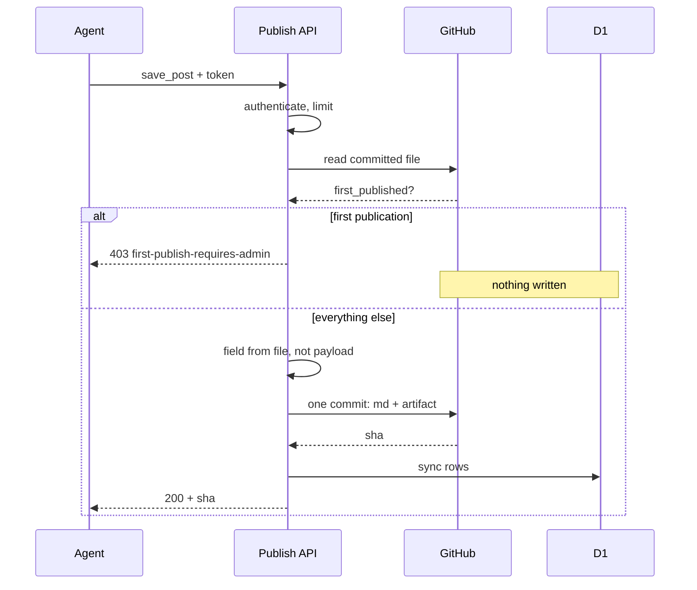

This article describes a trust model for giving an AI agent write access to a production website, as implemented and verified on this site, where an agent can create posts, edit live ones, withdraw and restore them, and where every such action lands as an attributed commit in version control. The model rests on four design decisions: the agent uses the same write path as the human, exactly one operation is reserved for the human and the reservation is enforced in code, the fact that enforcement depends on is stored tamper-evidently, and every guard is verified by observing it fail before it is trusted. I will present each decision with its rationale, the live verification transcripts, and the incident that exposed the model's genuinely hard problem, which is not the policy but the inventory of surfaces the policy must cover.

## Agent-accessible versus agent-operable

A distinction first, because the literature does not yet have settled terms. Call a system agent-accessible when AI systems can read it well: this site serves markdown twins of every post, returns search results as JSON, publishes llms.txt, and exposes search over the Model Context Protocol. All of that is read access, and the cost of errors is small. Call a system agent-operable when an agent can change what the system says. The entire cost of operability is the trust model, and the useful question is not whether an agent can write to production, which is trivially arrangeable, but what the agent must be prevented from doing and whether the prevention is enforced or merely requested. Requested means an instruction in a prompt. Enforced means a code path that refuses regardless of the prompt. Everything below is the second kind.

## Decision 1: one write path for every kind of author

The agent-facing layer here is a bearer-authenticated HTTP API whose operations call the same server module the human's browser editor calls: the same schema validation, the same prose gates, the same [atomic commit of the markdown file](/blog/content-is-code-building-the-blog), the same database and search-index synchronization. There is no agent-specific write path.

The rationale is the drift argument that recurs throughout this series: a second implementation of the rules is a second policy, and two policies diverge. A separate agent path would also reintroduce the exact failure the site's content architecture exists to prevent, the repository and the database disagreeing about whether a write happened. The counterfactual is worth stating because it is the easy version many systems ship: an agent writing directly to the database, with no diff, no history, and no gate. That design is faster to build and impossible to audit.

An implementation note that surprised me: exposing the machinery to a second caller required no refactoring, because the editor's earlier construction had already separated the save logic from its HTTP adapter, leaving the browser route a 55-line form-data shim over a callable function. If you are building the human path now and expect an agent path later, that separation is the cheapest preparation available.

## Decision 2: reserve exactly one operation, and choose it on reversibility

The agent may create posts, edit them, unpublish them, and republish them. It may not perform a post's first transition from draft to public. That single reservation is the whole policy, and the selection criterion was reversibility. First publication is the irreversible outward-facing act: the moment content reaches feeds, the sitemap, search indexes, and the AI answer layer, and becomes a public claim under a named person. Every operation after that moment amends something already public. Reserving only the debut leaves the agent genuinely useful, drafting, staging, fixing, while keeping the one moment of no return under human control.

The refusal, exactly as the agent receives it from the live system:

> Refused: publishing a post for the first time is reserved to the human admin. This post has never been public, so an operator cannot set draft to false on it. Save it as a draft (draft: true) and ask Dustin to publish it from /admin/posts. Once it has been published once, an operator may unpublish and republish it freely.
> policy: first-publish-requires-admin

Design the refusal as carefully as the permission. This one names its policy, explains the rule, and states the permitted alternative, and the agent-facing tool documentation says in advance that this refusal is correct behavior rather than an error to retry. An agent that understands a refusal as policy cooperates with it; an agent that reads it as a fault will try workarounds.

:::diagram{title="One save, and the single point where it can be refused" alt="A sequence diagram with four participants: the agent, the publish API, GitHub, and the D1 database. The agent sends a save request carrying a bearer token. The API authenticates it and applies its rate limit, then reads the post's existing committed file from GitHub to learn whether that post has ever been published. The diagram then branches. On the first branch the post has never been published and the save asks for draft false, so the API answers 403 with the code first-publish-requires-admin, and a note across GitHub and the database records that nothing is written: no commit, no row. On the second branch the API overwrites the first-publication field from the committed file rather than from the payload, lands one atomic commit (the edge is labelled md plus artifact, the July commit shape; since August 2026 the commit carries the markdown alone), receives the commit hash, writes the database rows, and only then answers 200 with that hash."}

The refusal happens before anything is written, and the durable fact it reads
comes from the committed file rather than from the caller's payload. That
ordering is the whole guarantee. The commit edge reads "md + artifact" because
that was the commit shape when this was drawn; since August 2026 the commit
carries the markdown alone, and the ordering is unchanged.
:::

## Decision 3: where the first-published fact lives, and the forgery it must survive

Enforcing "no first publication" requires answering a question that current state cannot answer: has this post ever been published? A post currently in draft is either brand new, which the policy must refuse, or previously published and withdrawn, which the policy must allow. Identical present states, opposite rulings. The system therefore needs a durable historical fact, and where that fact lives is the security-critical choice.

Here it lives in the post's own frontmatter, as a first-publication date, with one server-side property doing all the work: the value is read only from the committed file and overwritten on the way out of every save. Without the overwrite, the design has an obvious forgery: an agent submits the field in its own payload, asserting the very fact the gate checks, and thereby promotes any draft to publishable. The gate has a paired test for exactly that forgery, and I watched the test fail against both forgery variants before the guard was trusted, following a rule this series keeps re-earning: a guard never observed failing has not been verified.

The rejected alternative matters as much as the chosen one, because it fails open. Storing the fact in a database column looks cleaner, but this site's admin includes a repair action that rebuilds database rows from the committed markdown, and a security fact that silently disappears during routine maintenance is worse than one never recorded. The general principle: keep enforcement facts in the layer your recovery procedures treat as truth, and make them writable only by the enforcement path.

## Decision 4: verify with transcripts, not assertions

The full sequence was run live before this article was written, and I would treat that ordering as part of the method: the transcript is the claim. The agent created a draft; the commit carried the markdown and, in the pipeline of the time, its regenerated artifact, with a single parent and an operator marker in the message. The draft was confirmed absent from the blog index, both feeds, the sitemap, llms.txt, the search index, and the public answer layer. The publish attempt returned the refusal above, and afterward the post was unchanged, still draft, no publication fact recorded, because a refusal that writes anything is not a refusal. The human then published from the browser, and the same save stamped the first-publication date in the same commit. The agent edited the live post; the stamp survived. The agent unpublished and republished; the republication succeeded precisely because the fact existed, which is the entire distinction the frontmatter design carries. A forged new draft carrying the fact was rejected naming the field. A save containing a prohibited character was rejected naming line and column. In the resulting git history, the human's publish commit sits unmarked among operator-marked commits, so the repository can answer "did an agent write this" from the log alone, with no external correlation.

Three small mechanics from the same layer, each boring and each necessary. Token comparison is constant-time with both operands hashed to a fixed width first, so length does not leak through the loop bound. Rate limiting reuses [the site's existing synchronous-storage Durable Object](/blog/ai-answer-layer-ask-mode) rather than introducing a second mechanism. And the operator path's rate limit was tested with genuinely concurrent requests, because [the sequential-loop measurement trap documented in the AI layer article](/blog/ai-answer-layer-ask-mode) makes a working limiter look dead under a polite awaited loop; the concurrent burst here saw nineteen of forty-five refused, matching the configured window.

## How drafts leaked through the RAG index

On the operator path's first real use, staging five article drafts, every mechanism above worked, and the drafts still leaked. The site's AI answer layer, a public unauthenticated endpoint, answered a question from an unpublished draft and cited it by slug. I found it by probing with a phrase that existed only in that draft, which I would now recommend as a standard test.

The mechanism generalizes beyond this stack, which is why the incident belongs in the article rather than a changelog. The classic search index excludes drafts with a query-time filter. The AI layer's index has no per-item status a query can filter on, so exclusion must happen at upload time, and the upload path had never been wired into the visibility rule. No one decided drafts should reach that surface; no one decided anything, which is the failure. Beneath it, a second defect made the first fix report success while a draft remained answerable: the index's listing API is paginated, every call site fetched only the first page, and a purge whose targets sat on later pages reported zero removals, which reads as nothing to remove rather than an incomplete scan. Both defects are fixed and now covered by a check that was verified by removing each filter and watching it fail, and the draft-exclusion behavior is now visible in every save response rather than asserted in documentation.

The finding I would elevate above everything else in this article: a visibility policy is only as real as its least-connected surface, and every new surface a system grows is a new obligation that nobody audits by default. The trust model held. The inventory of surfaces is the hard problem, and it is hard because it is nobody's feature.

## Limitations

This model protects against an agent publishing; it does not protect against a compromised operator credential, whose holder can still edit live content and delete drafts. The mitigations are visibility and reversibility, every action is an attributed, revertable commit, and credential rotation measured in minutes, not prevention. The rate limiter's fixed window admits up to twice the limit across a boundary by construction, and the daily ceiling bounds abuse rather than preventing it. The single-reserved-operation policy reflects one person's judgment about reversibility on one site; a publication with legal review, or a multi-author system, would reasonably reserve more. And the surface-inventory problem is reported here as identified, not solved: the fix wired one surface into the rule, and the next surface this system grows will be someone's obligation to remember.

This post was drafted by the agent and staged through the write path it describes, as a draft, with the operator marker on its commit. Its first publication, like every first publication on this site, required the human. This is the eighth post in [the series](/blog/ten-years-on-cloudflare), following [the API versus MCP layering argument](/blog/one-door-two-doorbells); the final article covers [the protocol layer built on top of this access](/blog/the-doorbell-gets-built): an MCP server designed to contain no policy at all.

## Update, August 2026

Three of the limitations above have narrowed since publication. The save path's remaining drift window is now compensated: at the time of writing, a database failure after the commit landed left the repository and the derived index quietly disagreeing until the next repair, and the save now retries the index write once, records any persisting divergence where the sync status surface reads it, and returns an error naming the post, the commit that landed, and the repair path. The commit itself is never reverted to appease the index, because the repository is the source of truth and the index is derived from it. The operator credential gained a designed lifecycle, hashed storage with a 90 day maximum lifetime and overlap rotation so replacement is a non-event; it is built and parked on a branch, with the original token still in service until the operator cuts over. And the daily ceiling on the public answer layer no longer fails as a cliff: the same daily allowance is now released evenly across the day with a small burst, so a distributed caller exhausts minutes of the feature rather than the rest of the day, and the denial ends when the abuse does.

The trust model itself went through two external audits in August. Both confirmed the reservation and its enforcement. Several of their other claims about this codebase turned out to be stale or false when measured, which is this series' own argument arriving from outside: transcripts over assertions, for auditors too.

One change to the write path itself, on 26 August 2026: the repository no longer holds a rendered copy of the content, so a save commits the markdown file alone and the database holds the only rendered form, with each row recording the hash of the source it came from. Nothing in the trust model moved. The commit is still the attributed, revertable record; the first-publication fact still lives in the file and is still overwritten from the file on every save; and the rebuild path in Decision 3 still reads the committed markdown, which is now the only thing there is to read. The reasons for the change are in [the pipeline article's update](/blog/content-is-code-building-the-blog#update-26-august-2026-the-committed-artifact-came-out).
