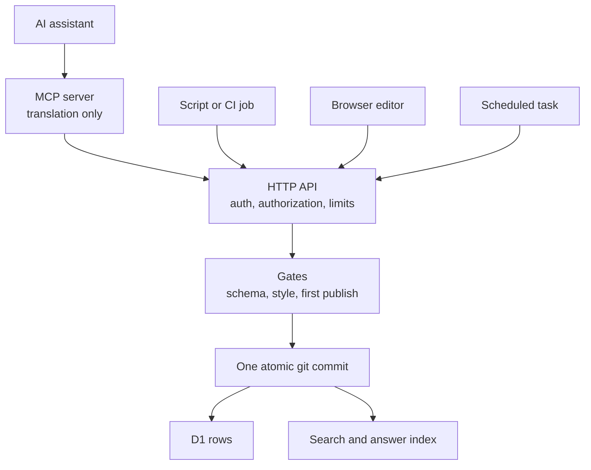

If you run a service that AI agents should be able to operate, you will face a design question that the current tooling discussion frames badly: should you build an API or an MCP server? This article argues, from two production implementations, that the question is malformed. An API and a Model Context Protocol server answer different questions, they compose as layers, and the design decision that actually matters is where the policy lives. The rule this article defends: all authentication, authorization, and business policy belongs in the HTTP API, implemented exactly once, and any MCP server should be a thin translation layer that contains none of it. I will define both terms, give the rule's rationale, show it running, and state where it might not apply.

## What an API is, what MCP is: definitions

An API, in the sense used here, is a durable HTTP contract: an endpoint that accepts authenticated requests, applies rules, and performs operations. The relevant example on this site is a publishing API: present a bearer token, submit an operation such as saving a post, and the server validates the content, enforces the publication policy, applies rate limits, and lands an atomic git commit. Any HTTP-speaking caller with the credential can use it: a script, a scheduled job, a CI step, or an AI agent.

The [Model Context Protocol](https://modelcontextprotocol.io), introduced by Anthropic in late 2024 and now supported across the major AI vendors, addresses a different problem: discovery and calling conventions for AI assistants. An MCP server describes its tools over the protocol, names, typed parameters, documentation, and a connected assistant can call them without anyone writing integration code specific to that assistant. The description is the integration. This solved a real combinatorial problem, many models times many tools, and it is why so many services became agent-callable so quickly.

Notice the division: the API is capability with rules; MCP is discoverability and calling convention. Neither replaces the other, and the failure mode worth an article is treating them as peers.

## The rule: authentication, authorization, and business policy live in the API

State the rule concretely: when an agent calls an MCP tool on my site, the MCP server translates that call into the same bearer-authenticated HTTP request any other caller would make, and the API decides. The MCP layer holds no validation logic, no permission checks, no rate limiting of the underlying operations, and no knowledge of the publication policy. A check script in its repository asserts this mechanically: no imports from the application codebase, no database binding, no repository credential. If the MCP layer were deleted, the set of allowed operations would not change.

The rationale has three parts, in decreasing order of importance.

First, duplication produces drift. If the MCP layer implemented its own copy of the rules, the system would have two policies that began identical and diverge, because every future change lands in one place first and sometimes never reaches the second. This is not speculative on this site: the same project earlier adopted [a one-renderer rule for its content pipeline](/blog/content-is-code-building-the-blog), after observing that two renderers made it impossible to distinguish content drift from implementation difference. Two enforcement points are the same defect in a different subsystem. A policy that exists in two places is two policies.

Second, auditability. When rules exist exactly once, there is exactly one code path to test, one to review after an incident, and one that can be wrong. The publication policy on this site (an agent may edit and republish but may not perform a post's first publication, covered in full in [the trust model article](/blog/letting-an-agent-publish)) is enforced in one function, exercised by one test suite, and produces one refusal message. Every caller, human tooling or agent, receives that same refusal verbatim.

Third, stability layering. HTTP with bearer authentication has been stable for decades. MCP is young and moving: its 2026-07-28 specification revision, current as this publishes, is a breaking change, the largest since the protocol launched, removing the session handshake and reworking authorization, though it arrives with a formal deprecation lifecycle promising twelve-month windows in the future. None of that is a criticism; it is what healthy young protocols do. It is, however, a strong argument about ordering: volatile layers belong on top of durable ones. When this site's MCP layer needed rework to track the new revision, the rework touched translation only. The policy did not move, because the policy does not live there.

:::diagram{title="Every kind of author enters through the same door" alt="A flow diagram with four callers on the left: an AI assistant, a script or CI job, the browser editor, and a scheduled task. The AI assistant goes first to an MCP server marked translation only, no policy. All four paths then converge on one box, the HTTP API, which holds authentication, authorization and rate limiting. From there a single path runs through the gates, which check schema, style and the first-publish policy, and on to one atomic git commit, which then fans out to the D1 rows and the search and answer indexes. The MCP server has no arrow of its own to the gates or the commit."}

The MCP server is one more caller, not a second entrance. Delete it and the set
of allowed operations is unchanged, which is the property the rule buys.
:::

## The same layering on the read side: three presentations, one engine

The publish path was not the first place this site used the pattern. [Its search engine](/blog/ai-answer-layer-ask-mode) ships at three levels: a plain URL anyone can construct, the same URL returning JSON under HTTP content negotiation, and an MCP endpoint an assistant can query conversationally. Three presentations, one engine. The removability of the top layer was verified by removal: with the MCP level off, the classic search response was byte-identical to before it existed. A presentation layer you can remove without touching behavior is a presentation layer wired correctly, and the test is cheap enough to run rather than assert.

## When to use the API directly and when to use MCP

Use the API directly when the caller is software you control or software that should outlive protocol churn: scripts, cron, deployment tooling, tests, integrations you write yourself. Use MCP when the caller is an AI assistant and the value is ambient availability: tools that appear in a conversation, described well enough to be used correctly without bespoke glue.

Two craft points for the MCP layer, both cheap and both frequently skipped. Write the policy into the tool descriptions, so an agent learns the rules before its first call; on this site, the save tool's description states the first-publication restriction and says explicitly that the refusal is correct behavior rather than an error to retry. And pass the API's error messages through verbatim rather than summarizing them, because the API's refusals name their policy and the permitted alternative, and a translation layer that paraphrases the lock misinforms the visitor.

One structural asymmetry is worth designing in deliberately: anything the MCP layer can do, the API can do, and not the reverse. If you find an operation possible through your MCP server that is not possible through your API, policy has leaked into the presentation layer, and the audit story from the rationale above no longer holds.

## Where the rule might not apply

The argument above is scoped to a particular situation: a service with meaningful rules, operated by identified callers, where policy drift and unaudited writes are the expensive failures. Different situations weigh differently, and honesty requires naming a few. A read-only MCP server over public data has little policy to misplace, and building it standalone is fine. A team standardized on an MCP-native gateway with centralized authorization may reasonably put enforcement in that gateway, which then simply is their API in this article's sense, wearing a different protocol. And MCP's own authorization story matured substantially in the 2026-07-28 revision, formalizing servers as OAuth 2.1 resource servers; identity of the caller can and should live at the MCP layer, which is distinct from policy about operations. On this site, those are literally two credentials: an OAuth flow answers who is operating, and the API's bearer token governs what operators may do. Keeping the two questions separate is what lets an authentication failure and a policy refusal read differently, because they are different.

The compressed form of the recommendation, for architects skimming: build the door once, with the lock in it, and add doorbells freely, provided every doorbell is only a doorbell. This is the seventh post in [the series](/blog/ten-years-on-cloudflare), following [the AI answer layer](/blog/ai-answer-layer-ask-mode). The next article examines the lock itself: [the trust model for giving an AI agent write access to a production system](/blog/letting-an-agent-publish), and the one operation it is structurally prevented from performing; the final one covers [building the MCP server](/blog/the-doorbell-gets-built) under the new specification.
